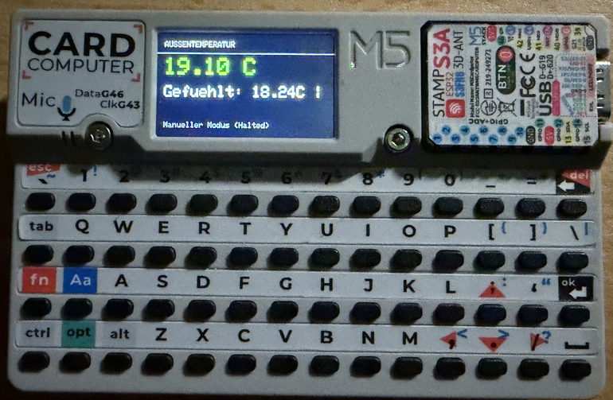
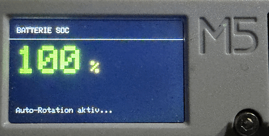

# M5Cardputer ioBroker Weather & Energy Monitor

Ein kompakter, smarter Monitoring-Client für den **M5Cardputer**, der Wetterdaten und Energiestatistiken (z. B. Batterie-SOC) direkt von einer **ioBroker**-Instanz über die HTTP REST API (z. B. den `simple-api`-Adapter) abruft und darstellt.




Das Projekt verfügt über eine automatische Playlist-Rotation, manuelle Direktwahl per Tastaturkürzel, eine automatische Display-Helligkeitsregelung nach Umgebungslicht (Lux), integriertes Energiespar-Timeout sowie optische und akustische Warnsignale bei Grenzwertüberschreitungen (z. B. Frost, Hitze, Sturm oder niedriger Batteriestand).

---

## Features

- **Automatisierte & Manuelle Rotation:** Wechselt zyklisch durch definierte Datenpunkte (Außentemperatur, Windgeschwindigkeit, Regenrate, Batterie-SOC) oder rastet per Tastendruck auf einer Ansicht ein.
- **Dynamische Helligkeitssteuerung:** Prüft periodisch den Lux-Wert eines Lichtsensors, um die Bildschirmhelligkeit an Nacht, Dämmerung, Tag oder pralle Sonne anzupassen.
- **Smart Power Management:** Schaltet das Display bei Inaktivität nach 5 Minuten komplett ab und weckt es beim nächsten Tastendruck sofort wieder auf.
- **Visuelle & Akustische Alarme:** Farbcodierte Warnbalken und Warntöne bei Frostgefahr, starkem Wind, Hitze oder leerer Batterie.
- **Direkte HTTP-Abfrage:** Kein schwergewichtiger MQTT-Client auf dem Microcontroller nötig – direkte JSON-Werteabfrage via ioBroker REST-Schnittstelle.

---

## Hardware-Voraussetzungen

- **M5Cardputer** (ESP32-S3 basiertes mobiles Entwicklungsboard mit Tastatur und Display)
- Lokales WLAN mit Verbindung zum ioBroker-Server

---

## Ordnungsstruktur

```text
m5cardputer-iobroker-monitor/
├── .gitignore
├── LICENSE
├── README.md
├── pictures/
│   └── preview.png      <-- Hier liegt das Vorschaubild
└── src/
    └── main.cpp

T $\rightarrow$ Außentemperatur (inkl. Gefühlt & Luftfeuchtigkeit innen)
W $\rightarrow$ Windgeschwindigkeit (mit Umrechnung $\text{m/s} \to \text{km/h}$)
R $\rightarrow$ Regen aktuell (inkl. Regen-Gesamtmenge)
B $\rightarrow$ Batterie SOC (%)Lizenz


Dieses Projekt steht unter der MIT License – siehe die LICENSE-Datei für Details.
